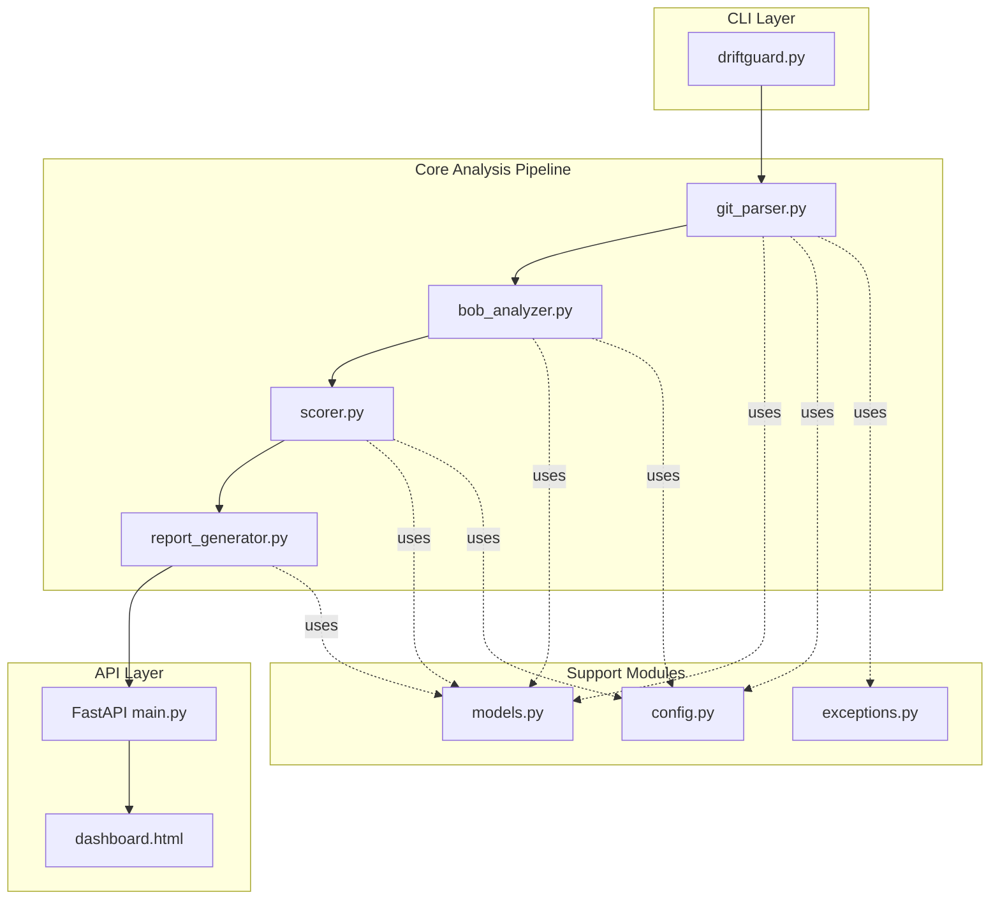

# DriftGuard Architecture Plan

## 1. Architecture Validation

### ✅ Strengths
- Clear separation of concerns (parsing → analysis → scoring → reporting → visualization)
- Modular design allows independent testing
- FastAPI + Chart.js is solid for quick dashboard MVP
- Rule-based heuristics avoid external API dependencies

### ⚠️ Issues & Missing Pieces

#### 1.1 Module Organization
**Issue**: Current structure mixes CLI and app modules
**Fix**: 
```
driftguard/
├── driftguard.py          # CLI entrypoint only
├── app/
│   ├── __init__.py
│   ├── git_parser.py      # Git operations
│   ├── bob_analyzer.py    # Rule-based analysis
│   ├── scorer.py          # Health score calculation
│   ├── report_generator.py # JSON report builder
│   ├── config.py          # Configuration constants
│   ├── models.py          # Data schemas (Pydantic)
│   ├── main.py            # FastAPI app
│   └── templates/
│       └── dashboard.html
```

#### 1.2 Missing Error Handling
**Risks**:
- Invalid git repos
- Binary files in diffs
- Large files (>1MB diffs)
- Git operations failures
- Malformed commit data

**Solution**: Add `app/exceptions.py` with custom exceptions and error recovery

#### 1.3 Missing Configuration
**Need**:
- File type filters (which extensions to analyze)
- Thresholds for health scores
- Max diff size limits
- Analysis rules configuration

**Solution**: Create `app/config.py` with constants and thresholds

#### 1.4 Missing Data Persistence
**Issue**: No storage for historical reports (trend analysis)
**Solution**: Add `app/storage.py` for JSON file persistence in `reports/` directory

#### 1.5 Bob Analyzer Scope
**Rule-based heuristics needed**:
- Documentation drift: Count TODO/FIXME/HACK comments added
- Test drift: Detect test file changes vs source file changes ratio
- Complexity growth: Measure lines added, nesting depth, function length
- Naming consistency: Check for inconsistent naming patterns

---

## 2. Data Flow Architecture

```mermaid
graph LR
    A[CLI Args] --> B[git_parser.py]
    B --> C[CommitData List]
    C --> D[bob_analyzer.py]
    D --> E[AnalysisResult List]
    E --> F[scorer.py]
    F --> G[ScoredFile List]
    G --> H[report_generator.py]
    H --> I[DriftReport JSON]
    I --> J[FastAPI main.py]
    J --> K[Dashboard HTML]
```



### Data Flow Steps

1. **CLI → git_parser**: `(repo_path: str, days: int, max_files: int)`
2. **git_parser → bob_analyzer**: `List[CommitData]`
3. **bob_analyzer → scorer**: `List[AnalysisResult]`
4. **scorer → report_generator**: `List[ScoredFile]`
5. **report_generator → FastAPI**: `DriftReport` (JSON)
6. **FastAPI → Dashboard**: `DriftReport` (rendered HTML)

---

## 3. Data Schemas

### 3.1 CommitData (git_parser.py output)
```python
from dataclasses import dataclass
from datetime import datetime
from typing import List

@dataclass
class FileDiff:
    """Represents changes to a single file in a commit."""
    filepath: str
    additions: int
    deletions: int
    diff_text: str  # Actual diff content
    is_binary: bool
    is_test_file: bool

@dataclass
class CommitData:
    """Represents a single commit with its file changes."""
    commit_hash: str
    author: str
    timestamp: datetime
    message: str
    files_changed: List[FileDiff]
```

### 3.2 AnalysisResult (bob_analyzer.py output)
```python
from dataclasses import dataclass
from typing import Dict, List

@dataclass
class DecayMetrics:
    """Rule-based decay metrics for a file."""
    # Documentation drift
    todo_count: int
    fixme_count: int
    hack_count: int
    comment_ratio: float  # comments / total_lines
    
    # Complexity growth
    lines_added: int
    lines_deleted: int
    max_nesting_depth: int
    avg_function_length: float
    
    # Test drift
    is_test_file: bool
    has_corresponding_test: bool
    
    # Naming consistency
    inconsistent_naming_count: int
    magic_numbers_count: int

@dataclass
class AnalysisResult:
    """Analysis result for a single file across all commits."""
    filepath: str
    total_commits: int
    total_changes: int  # additions + deletions
    decay_metrics: DecayMetrics
    raw_diffs: List[str]  # For debugging
```

### 3.3 ScoredFile (scorer.py output)
```python
from dataclasses import dataclass
from typing import Dict

@dataclass
class DimensionScore:
    """Score for a single decay dimension."""
    score: float  # 0-100
    weight: float  # 0-1
    details: Dict[str, any]  # Breakdown of score calculation

@dataclass
class ScoredFile:
    """Health score for a single file."""
    filepath: str
    overall_health: float  # 0-100 weighted average
    dimensions: Dict[str, DimensionScore]  # 4 dimensions
    risk_level: str  # "low", "medium", "high", "critical"
    recommendations: List[str]
```

### 3.4 DriftReport (report_generator.py output)
```python
from dataclasses import dataclass
from datetime import datetime
from typing import List, Dict

@dataclass
class RepoSummary:
    """Overall repository health summary."""
    total_files_analyzed: int
    avg_health_score: float
    files_at_risk: int  # health < 50
    total_commits: int
    analysis_period_days: int
    timestamp: datetime

@dataclass
class DriftReport:
    """Complete drift analysis report."""
    summary: RepoSummary
    files: List[ScoredFile]
    dimension_averages: Dict[str, float]  # Avg score per dimension
    top_risks: List[ScoredFile]  # Top 10 files by risk
    metadata: Dict[str, any]  # Repo path, CLI args, etc.
```

---

## 4. Top 3 Implementation Risks (48-hour timeline)

### Risk #1: Git Diff Parsing Complexity ⚠️ HIGH
**Challenge**: GitPython returns complex diff objects; extracting clean, analyzable text is non-trivial
**Impact**: Could consume 6-8 hours debugging edge cases
**Mitigation**:
- Start with simple `git log --stat` parsing
- Use `git show <commit>:<file>` for file content
- Skip binary files immediately
- Limit diff size to 10KB per file
- Test with a small, known repository first

### Risk #2: Rule-Based Heuristics Accuracy ⚠️ MEDIUM
**Challenge**: Simple regex/counting may produce noisy or meaningless scores
**Impact**: Dashboard shows data but insights are weak
**Mitigation**:
- Focus on 3-4 strong signals only:
  - TODO/FIXME growth rate
  - Lines changed per commit (churn)
  - Test file presence
  - Function length growth
- Use relative metrics (change over time) not absolute
- Add confidence scores to each metric
- Plan for LLM upgrade path in schema

### Risk #3: FastAPI + Chart.js Integration ⚠️ MEDIUM
**Challenge**: Passing JSON to Chart.js and handling async data loading
**Impact**: Could spend 4-6 hours on frontend debugging
**Mitigation**:
- Use Jinja2 to embed JSON directly in HTML (no AJAX for MVP)
- Start with simple bar chart (health scores)
- Use Chart.js CDN (no build step)
- Test with mock data first
- Keep dashboard read-only (no filters/interactions for MVP)

---

## 5. Build Order (8 Modules)

### Phase 1: Foundation (Day 1, Hours 0-8)
1. **`app/models.py`** (2 hours)
   - Define all Pydantic/dataclass schemas
   - Add validation and serialization
   - Write unit tests for schema validation

2. **`app/config.py`** (1 hour)
   - Define constants (file extensions, thresholds, limits)
   - Add configuration dataclass
   - Document all settings

3. **`app/git_parser.py`** (5 hours) ⚠️ CRITICAL PATH
   - Implement GitPython integration
   - Extract commits from last N days
   - Parse file diffs into `CommitData` objects
   - Handle errors (invalid repo, binary files)
   - Test with real repository

### Phase 2: Analysis Pipeline (Day 1-2, Hours 8-20)
4. **`app/bob_analyzer.py`** (6 hours)
   - Implement rule-based heuristics:
     - Count TODO/FIXME/HACK patterns
     - Measure complexity (nesting, function length)
     - Detect test files
     - Check naming patterns
   - Aggregate metrics per file
   - Return `AnalysisResult` objects
   - Test with sample diffs

5. **`app/scorer.py`** (4 hours)
   - Define scoring formulas for 4 dimensions
   - Calculate weighted health score (0-100)
   - Assign risk levels
   - Generate recommendations
   - Test with sample analysis results

6. **`app/report_generator.py`** (2 hours)
   - Aggregate scored files into `DriftReport`
   - Calculate summary statistics
   - Identify top risks
   - Serialize to JSON
   - Test with sample scored files

### Phase 3: CLI & API (Day 2, Hours 20-32)
7. **`driftguard.py`** (3 hours)
   - Wire up all modules in sequence
   - Add progress indicators
   - Handle CLI arguments
   - Write output JSON file
   - Add verbose mode for debugging
   - Test end-to-end with real repo

8. **`app/main.py`** (FastAPI) (4 hours)
   - Create `/` endpoint serving dashboard
   - Create `/api/report` endpoint returning JSON
   - Load report from file or run analysis
   - Add error handling
   - Test with uvicorn

### Phase 4: Dashboard (Day 2, Hours 32-40)
9. **`app/templates/dashboard.html`** (6 hours)
   - Design layout (header, summary cards, charts)
   - Integrate Chart.js for visualizations:
     - Overall health gauge
     - Dimension scores radar chart
     - Top risks table
     - File health bar chart
   - Add dark theme styling
   - Test with real report data

### Phase 5: Polish (Day 2, Hours 40-48)
10. **Testing & Documentation** (8 hours)
    - Write integration tests
    - Add error handling edge cases
    - Update README with usage examples
    - Add sample output screenshots
    - Test with 3-4 different repositories
    - Fix bugs and refine scoring

---

## 6. Module API Contracts

### git_parser.py
```python
def parse_repository(
    repo_path: str,
    days: int,
    max_files: int = 20,
    file_extensions: List[str] = ['.py', '.js', '.ts', '.java']
) -> List[CommitData]:
    """
    Parse git repository and extract commit data.
    
    Raises:
        InvalidRepositoryError: If repo_path is not a valid git repo
        GitOperationError: If git operations fail
    """
```

### bob_analyzer.py
```python
def analyze_commits(
    commits: List[CommitData],
    config: AnalysisConfig
) -> List[AnalysisResult]:
    """
    Analyze commits using rule-based heuristics.
    
    Returns one AnalysisResult per unique file across all commits.
    """
```

### scorer.py
```python
def score_files(
    analyses: List[AnalysisResult],
    config: ScoringConfig
) -> List[ScoredFile]:
    """
    Calculate health scores for analyzed files.
    
    Scores range from 0 (critical decay) to 100 (healthy).
    """
```

### report_generator.py
```python
def generate_report(
    scored_files: List[ScoredFile],
    metadata: Dict[str, any]
) -> DriftReport:
    """
    Generate final drift report with summary statistics.
    """

def save_report(report: DriftReport, output_path: str) -> None:
    """Save report as JSON file."""

def load_report(input_path: str) -> DriftReport:
    """Load report from JSON file."""
```

---

## 7. Configuration Constants

### app/config.py
```python
from dataclasses import dataclass
from typing import List

@dataclass
class AnalysisConfig:
    """Configuration for code analysis."""
    # File filters
    include_extensions: List[str] = ('.py', '.js', '.ts', '.java', '.go', '.rb')
    exclude_patterns: List[str] = ('node_modules/', 'venv/', '__pycache__/', '.git/')
    
    # Limits
    max_diff_size_kb: int = 100
    max_file_size_kb: int = 500
    
    # Analysis thresholds
    high_todo_threshold: int = 5
    high_complexity_threshold: int = 10
    long_function_threshold: int = 50

@dataclass
class ScoringConfig:
    """Configuration for health scoring."""
    # Dimension weights (must sum to 1.0)
    documentation_weight: float = 0.25
    test_weight: float = 0.30
    complexity_weight: float = 0.25
    naming_weight: float = 0.20
    
    # Risk level thresholds
    critical_threshold: float = 30.0  # < 30 = critical
    high_risk_threshold: float = 50.0  # 30-50 = high
    medium_risk_threshold: float = 70.0  # 50-70 = medium
    # > 70 = low risk
```

---

## 8. Error Handling Strategy

### app/exceptions.py
```python
class DriftGuardError(Exception):
    """Base exception for DriftGuard."""

class InvalidRepositoryError(DriftGuardError):
    """Raised when repository path is invalid."""

class GitOperationError(DriftGuardError):
    """Raised when git operations fail."""

class AnalysisError(DriftGuardError):
    """Raised when analysis fails."""

class ScoringError(DriftGuardError):
    """Raised when scoring fails."""
```

---

## 9. Testing Strategy

### Unit Tests (per module)
- `test_git_parser.py`: Test with mock git repo
- `test_bob_analyzer.py`: Test with sample diffs
- `test_scorer.py`: Test scoring formulas
- `test_report_generator.py`: Test JSON serialization

### Integration Tests
- `test_pipeline.py`: Test full CLI → JSON flow
- `test_api.py`: Test FastAPI endpoints

### Test Data
- Create `tests/fixtures/sample_repo/` with known commits
- Create `tests/fixtures/sample_diffs.json` with edge cases

---

## 10. Success Metrics

### MVP Success Criteria (48 hours)
- ✅ CLI runs without errors on real repository
- ✅ Generates valid JSON report
- ✅ Dashboard displays health scores visually
- ✅ Identifies at least 3 files with decay signals
- ✅ Scores are consistent and explainable

### Future Enhancements (Post-MVP)
- LLM-based analysis (replace rule-based heuristics)
- Historical trend tracking (store reports over time)
- GitHub Actions integration
- Slack/email alerts for critical decay
- Custom rule configuration via YAML
- Multi-repo analysis

---

## 11. Architecture Diagram



---

## 12. File Structure (Final)

```
driftguard/
├── driftguard.py              # CLI entrypoint
├── requirements.txt
├── README.md
├── ARCHITECTURE_PLAN.md       # This document
├── app/
│   ├── __init__.py
│   ├── models.py              # Data schemas (Pydantic)
│   ├── config.py              # Configuration constants
│   ├── exceptions.py          # Custom exceptions
│   ├── git_parser.py          # Git operations
│   ├── bob_analyzer.py        # Rule-based analysis
│   ├── scorer.py              # Health score calculation
│   ├── report_generator.py    # JSON report builder
│   ├── main.py                # FastAPI app
│   └── templates/
│       └── dashboard.html     # Dashboard UI
├── tests/
│   ├── __init__.py
│   ├── test_git_parser.py
│   ├── test_bob_analyzer.py
│   ├── test_scorer.py
│   ├── test_report_generator.py
│   ├── test_pipeline.py
│   └── fixtures/
│       └── sample_repo/
└── reports/                   # Generated reports (gitignored)
    └── .gitkeep
```

---

## Summary

This architecture provides:
1. ✅ Clear module boundaries with defined inputs/outputs
2. ✅ Comprehensive data schemas for all intermediate objects
3. ✅ Risk mitigation strategies for 48-hour timeline
4. ✅ Logical build order prioritizing critical path
5. ✅ Rule-based analysis (no external dependencies)
6. ✅ Extensibility for future LLM integration

**Next Steps**: Review this plan, then switch to Code mode to implement modules in the specified build order.